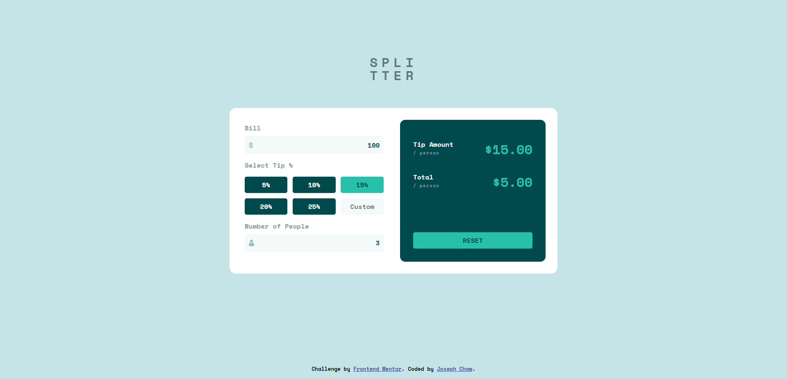
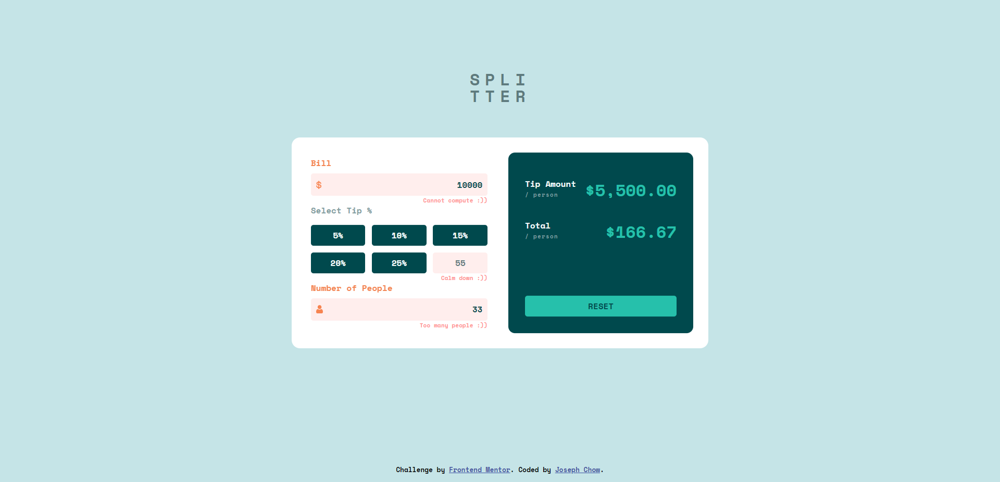

# Frontend Mentor - Tip calculator app solution

This is a solution to the [Tip calculator app challenge on Frontend Mentor](https://www.frontendmentor.io/challenges/tip-calculator-app-ugJNGbJUX). Frontend Mentor challenges help you improve your coding skills by building realistic projects.

## Table of contents

- [Overview](#overview)
  - [The challenge](#the-challenge)
  - [Screenshot](#screenshot)
  - [Links](#links)
- [My process](#my-process)
  - [Built with](#built-with)
  - [What I learned](#what-i-learned)
  - [Continued development](#continued-development)
  - [Useful resources](#useful-resources)
- [Author](#author)
- [Acknowledgments](#acknowledgments)

## Overview

### The challenge

Users should be able to:

- View the optimal layout for the app depending on their device's screen size
- See hover states for all interactive elements on the page
- Calculate the correct tip and total cost of the bill per person
- Provide input validation and error notification

### Screenshot





### Links

- Solution URL: [https://github.com/chowjiaming/tip-calculator-app-react](https://github.com/chowjiaming/tip-calculator-app-react)
- Live Site URL: [https://frontend-mentor-tip-calculator-app-chowjiaming.netlify.app/](https://frontend-mentor-tip-calculator-app-chowjiaming.netlify.app/)

## My process

### Built with

- Semantic HTML5 markup
- CSS custom properties
- Flexbox
- CSS Grid
- Mobile-first workflow
- [React](https://reactjs.org/) - JS library

### What I learned

I was having some issues with displaying and reseting the input field value for the custom tip input button. It would display the currently calculated tip percentage if the user were to click back onto one of the default value offerings. One soution I found was to have a separate state to display as value concurrently with the actual calculated tip percentage. This custom tip percentage value would be nulled out as soon as the calculated tip value changed back to default.

```js
const handleClick = (e) => {
  setInputData((prevState) => ({
    ...prevState,
    tipPercentage: parseInt(e.target.id),
    customTipPercentage: null,
    tipPercentageError: false,
  }));
};
```

```js
const handleCustomTip = (e) => {
  const re = /^[1-9]$|^[1-9][0-9]$|^(100)$/;
  if (!e.target.value) {
    setInputData((prevState) => ({
      ...prevState,
      tipPercentage: 0,
      customTipPercentage: 0,
    }));
  } else if (!re.test(e.target.value)) {
    setInputData((prevState) => ({
      ...prevState,
      tipPercentageError: true,
    }));
    e.target.value = inputData.tipPercentage;
  } else {
    setInputData((prevState) => ({
      ...prevState,
      tipPercentage: e.target.value,
      customTipPercentage: e.target.value,
      tipPercentageError: false,
    }));
  }
};
```

### Continued development

While this project was carried out under the challenge specs from Frontend Mentor, a currency selector and option to change colour theme would be a great continuing development opportunity.

## Author

- Website - [https://josephchow.dev](https://josephchow.dev)
- Frontend Mentor - [@chowjiaming](https://www.frontendmentor.io/profile/chowjiaming)
- Twitter - [@Couri3r](https://twitter.com/Couri3r)
